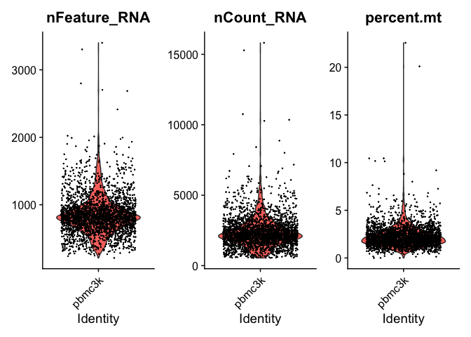
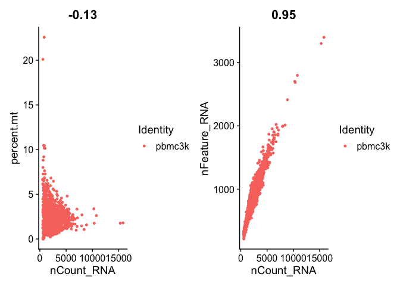

```r
library(dplyr)
library(Seurat)
library(patchwork)
```

<br>

Adapted from https://satijalab.org/seurat/v3.2/pbmc3k_tutorial.html

### Loading the data

About the Dataset: Peripheral Blood Mononuclear Cells (PBMC) freely available from 10X Genomics. There are 2,700 single cells that were sequenced on the Illumina NextSeq 500.
Obtained from: https://cf.10xgenomics.com/samples/cell/pbmc3k/pbmc3k_filtered_gene_bc_matrices.tar.gz


```r
# Load the PBMC dataset
pbmc.data <- Read10X(data.dir = "data/pbmc3k/filtered_gene_bc_matrices/hg19/")

# Initialize the Seurat object with the raw (non-normalized data).
pbmc <- CreateSeuratObject(counts = pbmc.data, project = "pbmc3k", min.cells = 3, min.features = 200)
```

```
## Warning: Feature names cannot have underscores ('_'), replacing with dashes
## ('-')
```

```r
pbmc
```

```
## An object of class Seurat 
## 13714 features across 2700 samples within 1 assay 
## Active assay: RNA (13714 features, 0 variable features)
```
<br>


```r
# Examining a few genes in the first thirty cells
pbmc.data[c("CD3D", "TCL1A", "MS4A1"), 1:30]
```

```
## 3 x 30 sparse Matrix of class "dgCMatrix"
```

```
##    [[ suppressing 30 column names 'AAACATACAACCAC-1', 'AAACATTGAGCTAC-1', 'AAACATTGATCAGC-1' ... ]]
```

```
##                                                                    
## CD3D  4 . 10 . . 1 2 3 1 . . 2 7 1 . . 1 3 . 2  3 . . . . . 3 4 1 5
## TCL1A . .  . . . . . . 1 . . . . . . . . . . .  . 1 . . . . . . . .
## MS4A1 . 6  . . . . . . 1 1 1 . . . . . . . . . 36 1 2 . . 2 . . . .
```
Sparse matrix format suitable for high 0 count data, saves memory

<br>

## Pre-processing Workflow

### QC and selecting cells for further analysis

A few QC metrics commonly used include:

* The number of unique genes detected in each cell.
* Low-quality cells or empty droplets will often have very few genes
* Cell doublets or multiplets may exhibit an aberrantly high gene count
* Total number of molecules detected within a cell (correlates strongly with unique genes)
* The percentage of reads that map to the mitochondrial genome. (Low-quality/dying cells often exhibit extensive mitochondrial contamination)

We calculate mitochondrial QC metrics with the PercentageFeatureSet function, which calculates the percentage of counts originating from a set of features
We use the set of all genes starting with MT- as a set of mitochondrial genes


```r
# The [[ operator can add columns to object metadata. This is a great place to stash QC stats
pbmc[["percent.mt"]] <- PercentageFeatureSet(pbmc, pattern = "^MT-")
```

<br>

The number of unique genes and total molecules are automatically calculated during CreateSeuratObject, and can be found stored in the object meta data

```r
# Show QC metrics for the first 5 cells
head(pbmc@meta.data, 5)
```

```
##                  orig.ident nCount_RNA nFeature_RNA percent.mt
## AAACATACAACCAC-1     pbmc3k       2419          779  3.0177759
## AAACATTGAGCTAC-1     pbmc3k       4903         1352  3.7935958
## AAACATTGATCAGC-1     pbmc3k       3147         1129  0.8897363
## AAACCGTGCTTCCG-1     pbmc3k       2639          960  1.7430845
## AAACCGTGTATGCG-1     pbmc3k        980          521  1.2244898
```

### Visualize QC Metrics


```r
# Visualize QC metrics as a violin plot
VlnPlot(pbmc, features = c("nFeature_RNA", "nCount_RNA", "percent.mt"), ncol = 3)
```

<!-- -->
<br>


```r
# FeatureScatter is typically used to visualize feature-feature relationships, but can be used
# for anything calculated by the object, i.e. columns in object metadata, PC scores etc.

plot1 <- FeatureScatter(pbmc, feature1 = "nCount_RNA", feature2 = "percent.mt")
plot2 <- FeatureScatter(pbmc, feature1 = "nCount_RNA", feature2 = "nFeature_RNA")
plot1 + plot2
```

<!-- -->
<br>

#### Filtering criteria:
* Remove cells that have unique feature counts over 2,500 or less than 200
* Remove cells that have >5% mitochondrial counts


```r
pbmc <- subset(pbmc, subset = nFeature_RNA > 200 & nFeature_RNA < 2500 & percent.mt < 5)
```
<br>
<br>

## Normalize Counts Data

The default normalization for Seurat is a global-scaling normalization method "LogNormalize" that normalizes the feature expression measurements for each cell by the total expression, multiplies this by a scale factor (10,000 by default), and log-transforms the result. Normalized values are stored in pbmc[["RNA"]]@data.


```r
pbmc <- NormalizeData(pbmc, normalization.method = "LogNormalize", scale.factor = 10000) # showing default parameters
```
<br>


## Feature selection

Compute a subset of features that exhibit high cell-to-cell variation in the dataset (i.e, they are highly expressed in some cells, and lowly expressed in others). Focusing on these genes in downstream analysis helps to highlight biological signal in single-cell datasets.


